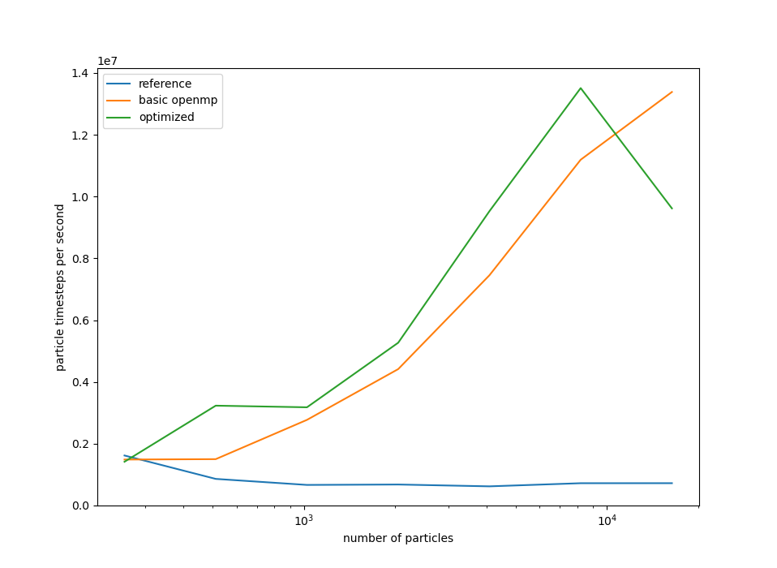

# Exercise 4: molecular dynamics simulation

**Due:** October 6, before class.

**Collaboration:** you may work in teams of two.  Your team may consult online
resources, others in the class, and the instructor and TA, but your work must
be your own.  Copying other students' code will be considered an honor code
violation.

This project is hosted in a repository on <https://github.gatech.edu/cse6230fa21/cse6230ex4>.

Your team should clone the repository into a local copy that you will use to develop.

## Where to run

This code is to be run on the `coc-ice` queue on nodes with 24 CPU cores.

The `Makefile` is set up use the Intel compiler by default, but you are allowed to change that by:

- changing the definition of `MAKERULES` in the `Makefile`,
- changing flags in the appropriate `make.defs` file,
- updating `test.pbs` to load the modules that you need instead of the `intel` module

## About the code

## About this program

The code for this assignment started out almost exactly the same as your third assignment with interacting particles.  We saw in that assignment the way that $O(n^2)$ interactions in an $n$-body simulation dominate the rest of the operations.  This project shows an attempt to return that work complexity from $O(n^2)$ back down to $O(n)$ or thereabouts.
  
Some of the potentials that define interactions in molecular dynamics decay *quite* rapidly.  So rapidly, that it is not a terrible approximation to assign to each particle an effective **radius $r$**.  If two particles are not touching (that is if their centers are more than $2r$ apart), then the interactions can safely be ignored (particularly if it will be drowned out relative to the background *Brownian* noise that we saw last week).  In side of $2r$, then the overlapping particles start pushing each other apart.

If you'd like to see the particulars of this assignments force due to interactions, you can look at the inner loop body of `accelerate_direct()` which approximates [steric effects](https://en.wikipedia.org/wiki/Steric_effects).

Now, suppose that our particles bounce around and repel each other until they are roughly in equilibrium.  We would expect that they would be well spread out, and that the chance of any two particles interacting would be no more likely than two particles placed at random.

A particle interacts with any particle within a range of $2*r$, which means that around each particle there is a sphere with volume $V_p = (4/3) \pi (2r)^3\approx 33 r^3$: any particle whose center is outside of that cell does not interact.  Suppose the volume of the periodic domain is $V_D$, and there are $N_p$ particles.  Then if the other $N_p - 1$ particles are distributed at random, then we expect $V_p (N_p - 1)/ V_D$ of those particles to interact with the particle in question.  Therefore we might expect $N_p V_p (N_p - 1) / 2 V_D$ interactions in total.

What's the point of this calculation?  Well, when running a periodic simulation, we are trying to approximate a larger domain with a fixed *density* of particles per volume.  Thus, if we consider $\phi = N_p/ V_D$ to be a fixed density of the problem we are trying to simulate, then the number of interactions is $\approx (N_p - 1) \phi / 2$.
*We should expect the number of interactions to scale linearly with the number of particles if we keep $\phi$ fixed.*

So how can we exploit the fact that only $O(N_p)$ interactions are expected instead of $O(N_p^2)$?  In our acceleration routine, we should try to rule out particles from interacting with each other.

One way to do this is *binning*: we divide up our periodic domain $[-L/2,L/2)^3$ into a grid of $b$ boxes per dimension, $b^3$ boxes total.  An algorithm would look like the following:

1. Given each particles coordinates, assign it to the appropriate box.
2. If the length of a box $(L / b)$ is longer than $2r$, then every particle can only interact with particles
  - In its own box,
  - In neighboring boxes
3. So loop over neighboring boxes and create a list of *pairs of particles* that are close enough to interact.

This is what is done now in `accelerate.cc`: `accelerate_indirect()` method of the `Accel::Impl` object reorders the particles into bins and then loops over the bins, only calculating the interactions between neighboring bins.

The previous $O(N_p^2)$ calculation is available for comparison and debugging purposes with the `-use_direct` flag.

## Objective

### Performance (50%)

The main objective of this assignment is modify the code in any way you see fit to improve its performance.

You can accomplish this in any way, but the way I recommend is to parallelize
the `accelerate_indirect()` method, including the `bin_particles()` and
`unbin_particles()` methods.  Parallelizing `bin_particles()` requires coordination between the threads,
so you will have to pay attention to the proper use of openmp synchroniziation
directives: `atomic`, `critical`, `single`, `barrier`, etc.

The batch script `test.pbs` generates `timings.json` and `timings.png` for your code.  You are allowed to modify `test.pbs` to change the makefile target `timings.json` to change the openmp environment (you could, for example, use only 12 threads on socket of the node), but this is the only change your are allowed to make to that target.

Your performance will be judged by the **highest particle timesteps per second** that your code achieves for any problem size.

- $>$ 12 million particle timesteps per second: 55% / 50%
- $>$ 10 million particle timesteps per second: 50% / 50%
- $>$ 0.9 million particle timesteps per second: 45% / 50%
- $>$ 0.8 million particle timesteps per second: 40% / 50%
- $>$ 0.7 million particle timesteps per second: 35% / 50%
- $>$ 0.6 million particle timesteps per second: 30% / 50%
- $>$ 0.5 million particle timesteps per second: 25% / 50%
- $>$ 0.4 million particle timesteps per second: 20% / 50%
- $>$ 0.3 million particle timesteps per second: 15% / 50%
- $>$ 0.2 million particle timesteps per second: 10% / 50%
- $>$ 0.1 million particle timesteps per second: 5% / 50%

### Correctness (35%)

You code must still be correct.  We will assess correctness in the following way:

- Passing the `make reproducibility_check` test (10%): the random number generator in this assignment uses a randomized hashing algorithm, which means that it can generate the exact same random number for every simulation, regardless of how many openmp threads you use.  We should be able to run your code for one timestep with any number of threads and get the same result to within the six digits of accuracy that are used to print the computed diffusivity constant.

- Passing the `make coefficient_test` test (10%): the diffusivity coefficient that we calculate of a simulation with a small number of particles or a small number of timesteps will be biased.  This test simulates 16,384 particles for 20,000 timesteps to estimate the coefficient.  The results from my reference implementation were fairly narrowly centered around 0.83, but I have given you a six-$\sigma$ window of [0.8, 0.876] for your calculation to be considered correct.

- Source code inspection (10%): the TA and I will deduct points for incorrect code that did not manifest in either of the above two tests, with particular focus on the proper use of openmp in the `accelerate_indirect()` method.

- Clean compilation (5%): if the TA and I can compile you code from scratch and their are no errors or warnings.

### Report (15%)

Make a report that includes:

- The `timings.png` generated by the `test.pbs` script (5%)
- A description of the optimization and parallelization changes that you made to the code (10%)

